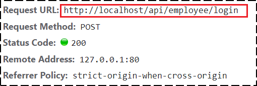
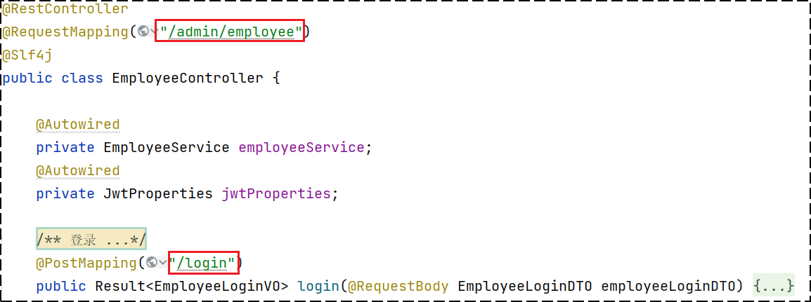
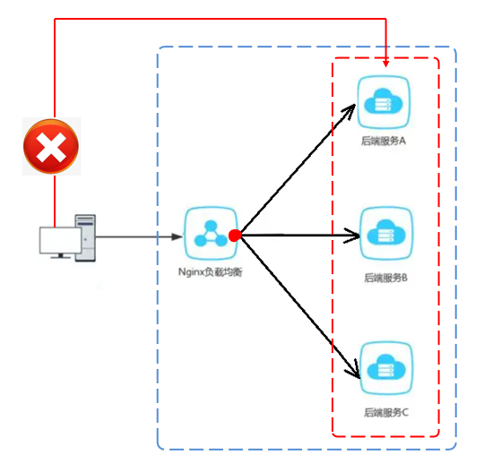

### Nginx 反向代理和负载均衡

**前端发送的请求，是如何请求到后端服务的？**

前端请求地址：http://localhost/api/employee/login

后端接口地址：http://localhost:8080/admin/employee/login

**前端请求地址：**



**后端接口地址：**



**Nginx 反向代理**，就是将前端发送的动态请求由 Nginx 转发到后端服务器

**Nginx 反向代理的好处：**

- **提高访问速度**：因为 Nginx 本身可以进行缓存，如果访问的同一接口，并且做了数据缓存，Nginx 就直接可把数据返回，不需要真正地访问服务端，从而提高访问速度。

- **负载均衡**：所谓负载均衡，就是把大量的请求按照我们指定的方式均衡的分配给集群中的每台服务器。

- **保证后端服务安全**：因为一般后台服务地址不会暴露，所以使用浏览器不能直接访问，可以把 Nginx 作为请求访问的入口，请求到达 Nginx 后转发到具体的服务中，从而保证后端服务的安全。



**Nginx 反向代理的配置方式：**

```nginx
server{
    listen 80;
    server_name localhost;
    
    location /api/{
        proxy_pass http://localhost:8080/admin/; #反向代理
    }
}
```

**proxy_pass：**该指令是用来设置代理服务器的地址，可以是主机名称，IP地址加端口号等形式。如上代码的含义是：监听 80 端口号， 当我们访问 http://localhost:80/api/../.. 这样的接口的时候，它会通过 location /api/ {} 这样的反向代理转交访问到 http://localhost:8080/admin/ 上来。

**Nginx 负载均衡**

当服务以集群的方式进行部署时，那 Nginx 在转发请求到服务器时就需要做相应的负载均衡。其实，负载均衡从本质上来说也是基于反向代理来实现的，最终都是转发请求。

Nginx 负载均衡的配置方式：

```nginx
upstream webservers{
    server 192.168.100.128:8080;
    server 192.168.100.129:8080;
}
server{
    listen 80;
    server_name localhost;
    
    location /api/{
        proxy_pass http://webservers/admin;#负载均衡
    }
}
```

**upstream：**如果代理服务器是一组服务器的话，就可以使用 upstream 指令配置后端服务器组中每一个服务器的地址。upstream 后面的名称可自定义，但要上下保持一致。

如上代码的含义是：监听80端口号， 然后当我们访问 http://localhost:80/api/../.. 这样的接口的时候，它会通过 location /api/ {} 这样的反向代理转交访问到 http://webservers/admin，根据 webservers 名称找到一组服务器，根据设置的负载均衡策略(默认是轮询)转发到具体的服务器。

**Nginx 负载均衡策略：**

| **名称**   | **说明**                                               |
| ---------- | ------------------------------------------------------ |
| 轮询       | 默认方式                                               |
| weight     | 权重方式，默认为1，权重越高，被分配的客户端请求就越多  |
| ip_hash    | 依据ip分配方式，这样每个访客可以固定访问一个后端服务   |
| least_conn | 依据最少连接方式，把请求优先分配给连接数少的后端服务   |
| url_hash   | 依据url分配方式，这样相同的url会被分配到同一个后端服务 |
| fair       | 依据响应时间方式，响应时间短的服务将会被优先分配       |

具体配置方式示例：

**轮询：**

```nginx
upstream webservers{
    server 192.168.100.128:8080;
    server 192.168.100.129:8080;
}
```

**weight:**

```nginx
upstream webservers{
    server 192.168.100.128:8080 weight=90;
    server 192.168.100.129:8080 weight=10;
}
```

**ip_hash:**

```nginx
upstream webservers{
    ip_hash;
    server 192.168.100.128:8080;
    server 192.168.100.129:8080;
}
```

**least_conn:**

```nginx
upstream webservers{
    least_conn;
    server 192.168.100.128:8080;
    server 192.168.100.129:8080;
}
```

**url_hash:**

```nginx
upstream webservers{
    hash &request_uri;
    server 192.168.100.128:8080;
    server 192.168.100.129:8080;
}
```

**fair:**

```nginx
upstream webservers{
    server 192.168.100.128:8080;
    server 192.168.100.129:8080;
    fair;
}
```

